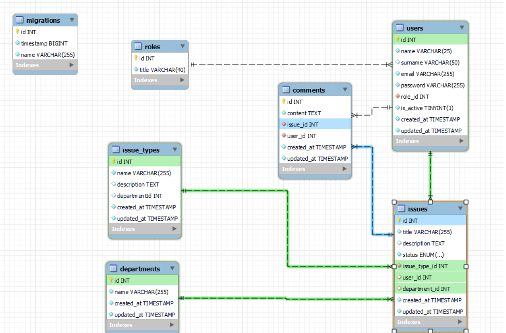

<div align=center>

# Proyecto de Backend
## Tattoo Studio

 Este es el backend del sistema de gestion de incidencias. Este proyecto se realizó como parte del Bootcamp Full Stack Developer de [](https://geekshubsacademy.com/)


## Tecnologías Utilizadas

[](https://www.typescriptlang.org/)[](https://www.mysql.com/)[](https://nodejs.org/en)[](https://www.npmjs.com/)[](https://github.com/)[](https://expressjs.com/)[](https://typeorm.io/)[](https://www.thunderclient.com/)[](https://jwt.io/)[](https://nodemon.io/)
</div>

## Tabla de Contenidos
- 🧾[Usuarios demo](#usuarios-bbdd)
- 🧾[Diseño BBDD](#diseño-bbdd)
- ⚙️[Instalacion en local](#einstalacion-en-local)
- 🎯[Endpoints](#endpoints)
- 💻[Contacto](#contacto)
- 🪪[Creditos](#creditos)


## Usuarios demo

```js
{
    user: "superadmin@superadmin.com,
    password: "123456"
}

{
    user: "dani@dani.com,
    password: "123456"
}
```

## Diseño BBDD


## Instalación en local
Nota: Es necesario tener instalado [](https://nodejs.org/en)

1. Clonar el repositorio con el comando`$ git clone [URL del repositorio]`
2. Instalar dependencias con el comando` $ npm install `
3. Conectamos nuestro repositorio con nuestra base de datos, en el archivo ".env.example" tenemos un ejemplo, quitamos el ".example" y el archivo deberia quedar ".env", sustituimos valores con las credenciales de nuestra base de datos. El ultimo valor, seria el secreto de nuestro token.
4. Ejecutamos las migraciones con el comando`$ npm run run-migrations`
5. Ejecutamos los seeders `$ npm run seeder`
6. Ponemos en funcionamiento el servidor `$ npm run dev`

## Endpoints
[Endpoints collection json thunder client](./HTTP/thunder-collection_PROYECTO%20FINAL.json)

## Contacto

[](mailto:claudiaalvaro17@gmail.com)[](https://www.linkedin.com/in/vanessabritogonzalezhttps://www.linkedin.com/in/claudia-alvaro-cano-47860538/)

## Créditos
Este proyecto ha sido realizado por mi, Claudia Álvaro, como parte del Bootcamp Full Stack Developer de [](https://geekshubsacademy.com/)
